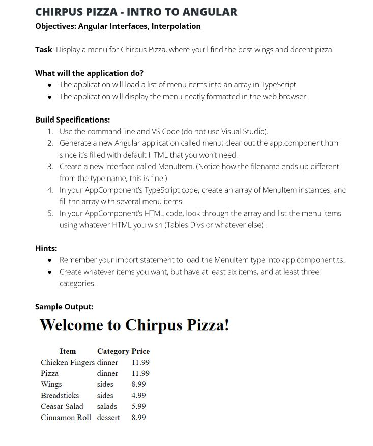
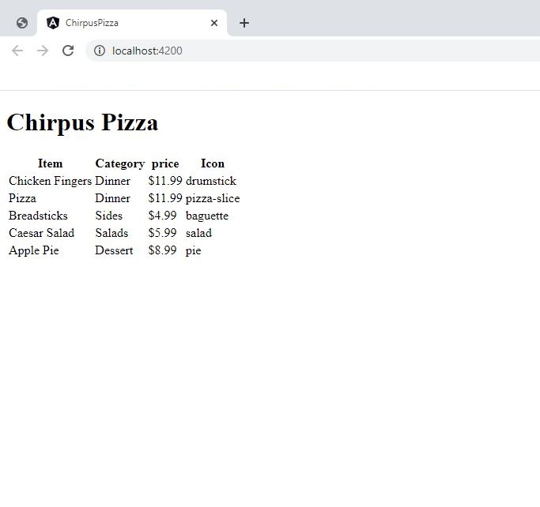

# ChirpusPizza

This project was generated with [Angular CLI](https://github.com/angular/angular-cli) version 14.1.3.

install VS code
install node.js

## Run below Steps at command line to install typescript and angular included as : 
- ng install -g typescript
- ng install -g @angular/cli

## Few addtional commands to help refresh user :
- ng new <folder name>        ---> creates new folder and setup angular inside it 
- code . && exit              ---> Opens pertaining folder in VS code
- ng serve                    ---> compiles the typescript and serves the page link (localhost:4200)
- ng g c component/example    ---> creates "example-component" inside component folder
- ng g i interface/player     ---> creates "player" interface inside interface folder
- ng g s services/player      ---> creates "player" service inside services folder

## Important information :
- "app.component.ts" and  "app.component.html"  files under the src/app  are the main files where edit is made in this project

## Development server

Run `ng serve` for a dev server. Navigate to `http://localhost:4200/`. The application will automatically reload if you change any of the source files.

## The Requirement was as follow : 

## The output is seen as below :

